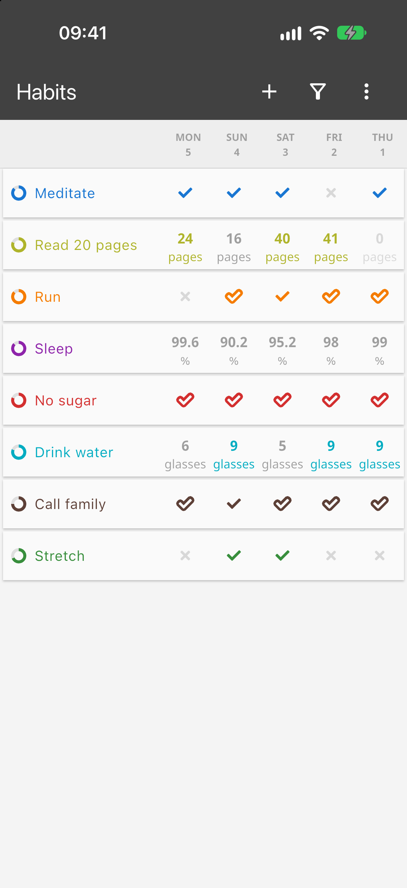
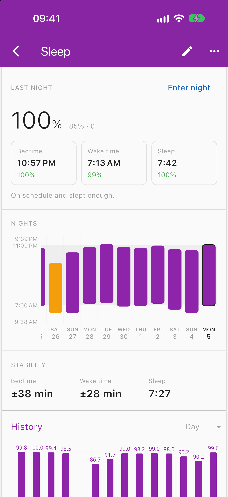
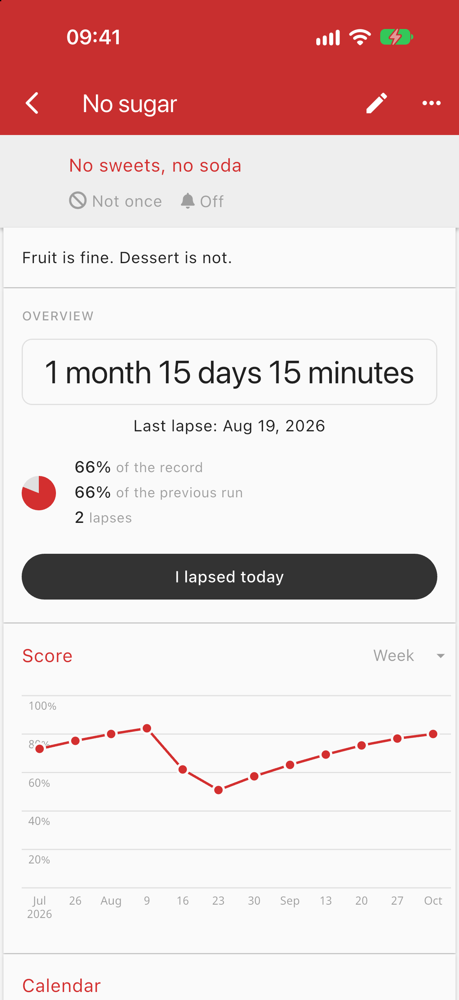
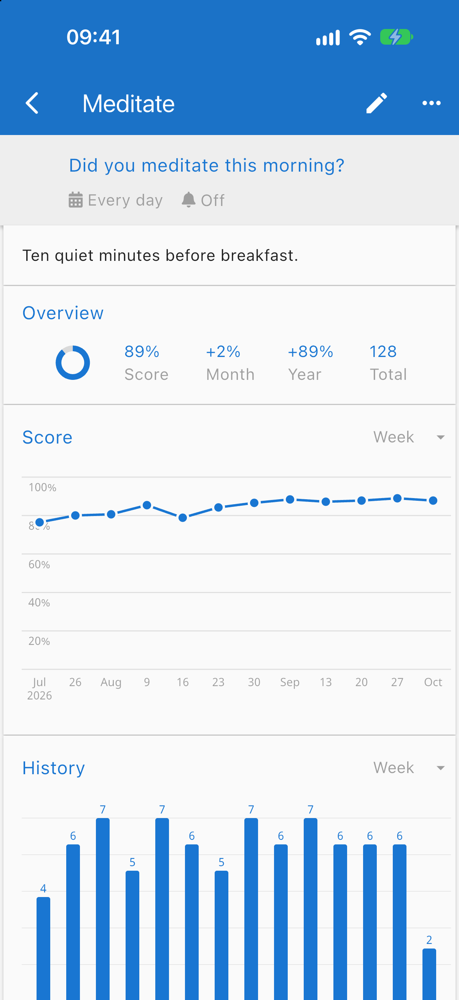
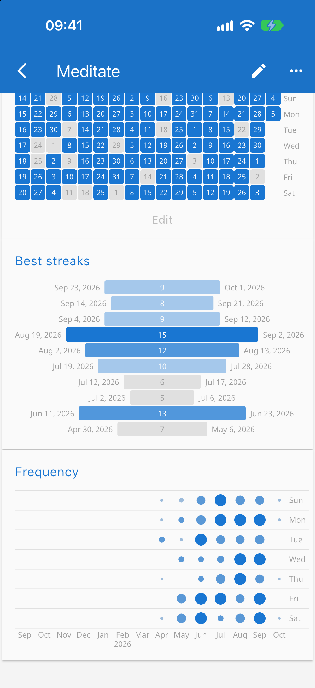
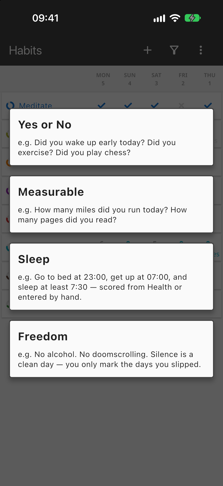
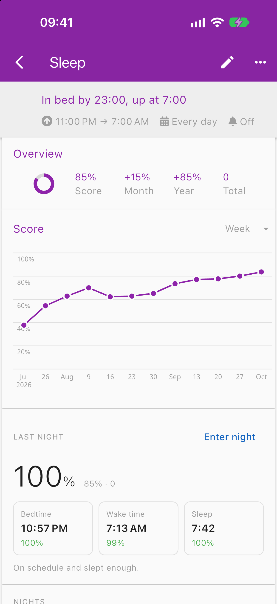
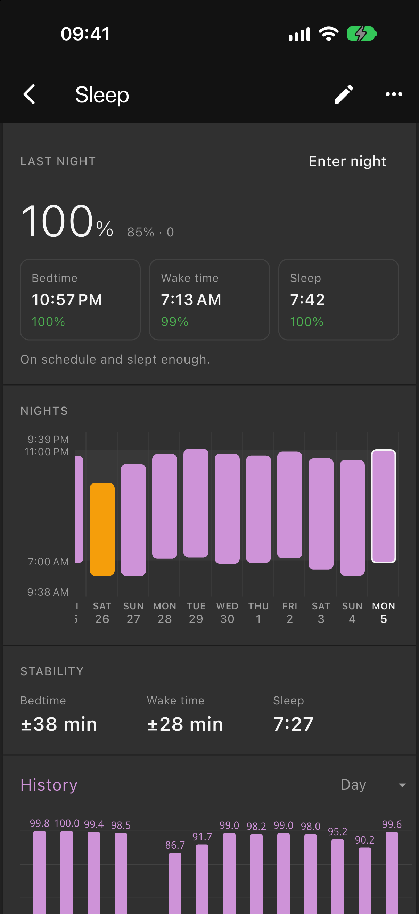
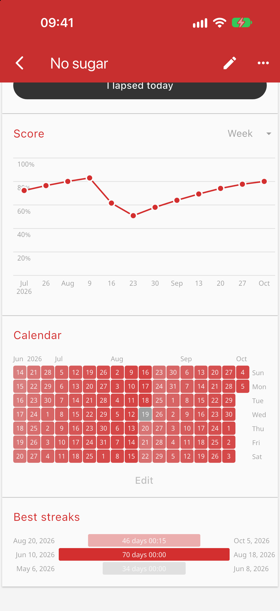
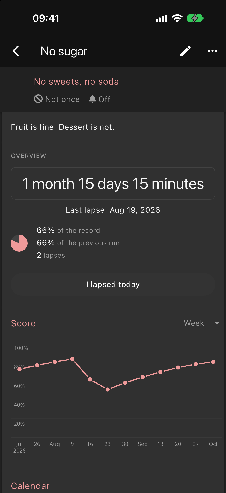

<h1 align="center">Loop Habit Tracker — Flutter port</h1>

<p align="center">
  The habit tracker from <a href="https://github.com/iSoron/uhabits">iSoron/uhabits</a>, rebuilt in Flutter so that it runs on iOS as well as Android.
</p>

<p align="center">
  
  
  
</p>

## About this fork

This repository is a fork of [**iSoron/uhabits**](https://github.com/iSoron/uhabits),
Loop Habit Tracker by Álinson S. Xavier and its contributors. Loop is an
Android app written in Kotlin; everything that makes it a good habit tracker —
the score formula, the charts, the flexible schedules — comes from that project.

Loop has no iOS version. The original code keeps its logic in a Kotlin
Multiplatform core, and the obvious route to iOS would have been to write a
separate native UI and a separate set of components for the iOS side on top of
it. This fork deliberately does not do that. The decision was to write one
cross-platform application in Flutter instead, and carry the whole app over.

So the work here falls into two parts:

1. **The port.** The existing app, re-implemented in Dart and Flutter, behaving
   the way the Kotlin app behaves. It builds for iOS.
2. **New features.** Two habit types the original does not have: **Sleep** and
   **Freedom**.

The work lives on the [`flutter-migration`](https://github.com/efim0v/uhabits/tree/flutter-migration)
branch, under [`uhabits-flutter/`](uhabits-flutter). The `dev` branch mirrors
upstream, and the original Kotlin sources are kept in the tree untouched.

## Carried over from Loop

These screens exist in the original app. Nothing about them is new — they were
brought across, and now they run on an iPhone.

<p align="center">
  
  
  
</p>

- **Habit list.** Every habit with its last few days: check marks for yes-or-no
  habits, numbers for measurable ones.
- **Habit statistics.** The score ring and score chart, history, calendar, best
  streaks and frequency.
- **Habit score.** Loop's formula: every repetition makes the habit stronger,
  every miss makes it weaker, and a few missed days after a long streak do not
  wipe out the progress.
- **Flexible schedules, reminders, CSV and database export, light and dark
  themes, 50 languages.**

To keep the port honest, the behaviour of the Kotlin app is written down as a
ledger of rules in [`docs/parity/FEATURES.md`](docs/parity/FEATURES.md), and each
rule is cited by a test in the Flutter code. Intentional differences are listed
in [`docs/parity/DEVIATIONS.md`](docs/parity/DEVIATIONS.md).

## New in this fork

The "new habit" dialog offers four types instead of two.

<p align="center">
  
</p>

### Sleep

A habit with a target bedtime, a target wake time and a minimum amount of
sleep. Each night gets a score from 0 to 100%.

<p align="center">
  
  
  
</p>

- **Last night.** The overall score, plus separate scores for bedtime, wake
  time and duration, with a one-line verdict.
- **Nights.** Each night drawn as a bar from bedtime to wake time against the
  goal band, so drifting late or oversleeping is visible at a glance.
- **Stability.** How much bedtime and wake time vary, and the average sleep.
- **Where the data comes from.** Apple Health on iOS, or entered by hand. A
  night entered by hand is never overwritten by Health data.
- **In the list**, a sleep habit shows each night's percentage and feeds the
  same score, history and calendar as any other habit.

### Freedom

A commitment *not* to do something: no sugar, no alcohol, no doomscrolling.
Ordinary trackers make you confirm every day that you did not do it. Here
silence is a clean day — you only mark the days you slipped.

<p align="center">
  
  
  
</p>

- **A running counter** of the time since the last lapse, down to the minute,
  counted from the day you made the commitment.
- **One button**, "I lapsed today". Tapping it again takes it back.
- **How the current run compares** with your record and with the previous run.
- **A calendar that brightens** along each clean run and drops out on the day
  of a lapse.
- **A score that starts from zero** and grows as the run gets longer; a lapse
  cuts it in half rather than resetting it.
- **Lapses are kept in their own log**, survive backup and restore, and are
  included in the CSV export.

## Status

The port is developed and run on iOS, including on a physical iPhone. Android
and macOS targets are in the project as well; iOS is the one being exercised.
This is a personal fork and is not published to the App Store or Google Play.
For the released Android app, go to the
[original project](https://github.com/iSoron/uhabits).

## Building

You need [Flutter](https://docs.flutter.dev/get-started/install) and, for iOS,
Xcode.

```sh
git clone -b flutter-migration https://github.com/efim0v/uhabits.git
cd uhabits/uhabits-flutter/app
flutter pub get
flutter run
```

To run the tests for the core package and the app:

```sh
cd uhabits/uhabits-flutter
./test.sh
```

## Repository layout

| Path | Contents |
|---|---|
| [`uhabits-flutter/app`](uhabits-flutter/app) | The Flutter application |
| [`uhabits-flutter/packages/uhabits_core`](uhabits-flutter/packages/uhabits_core) | Models, scoring and storage in pure Dart |
| [`docs/parity`](docs/parity) | The rules ledger for the port and the list of deviations |
| [`docs/extensions`](docs/extensions) | The rules for Sleep and Freedom, which have no counterpart upstream |
| `uhabits-android`, `uhabits-core` | The original Kotlin sources, unchanged |

## License


Loop Habit Tracker is Copyright (C) 2016-2025 Álinson Santos Xavier
<isoron@gmail.com> and is free software under the GNU General Public License,
version 3 or later. This fork is distributed under the same license; see
[LICENSE.txt](LICENSE.txt).

It is distributed in the hope that it will be useful, but WITHOUT ANY WARRANTY;
without even the implied warranty of MERCHANTABILITY or FITNESS FOR A PARTICULAR
PURPOSE. See the GNU General Public License for more details.
